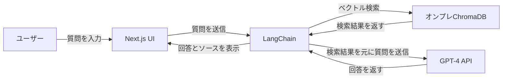
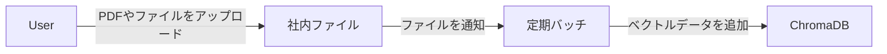

# GPT-4 & LangChain - Create a ChatGPT Chatbot for Your PDF Files
[オリジナルのレポジトリ](https://github.com/mayooear/gpt4-pdf-chatbot-langchain)にある仕組みから以下を変更
- 日本語対応
  - chat gpt側に日本語で説明するようにmakechain.tsのプロンプトを変更

- chroma dbを使用するように変更
  - chroma dbを使用するように変更することでベクトルDBもオンプレで構築可能に変更


## 起動

1. レポジトリのクローン
  ```
  git clone [github https url]
  ```
2. Install packages
  ```
  pnpm install
  ```
3. `.env`ファイルセットアップ

   - `.env.example`を`.env`ファイルとしてコピー
      `.env`は以下のようになっている
      ```
      OPENAI_API_KEY=
      ```

   - [openai](https://help.openai.com/en/articles/4936850-where-do-i-find-my-secret-api-key)でAPIキーを手に入れて、 `.env` に入力

4. chroma dbを起動
  ```
   docker compose up
  ```
5. アプリ起動
  ```
  pnpm run dev
  ```
  
## NOTE: もしDB URLを変えたいなら
- `scripts/ingest-data.ts`の以下を変更
  ```
    await Chroma.fromDocuments(docs, embeddings, {
      collectionName: 'langchain_store',
      url:"http://localhost:8882" // もし別URLでChromaを立ち上げている場合はここを変更する
    })
  ```
- `pages/api/chat`の以下を変更
  ```
     const vectorStore = await Chroma.fromExistingCollection(
        new OpenAIEmbeddings({}),
        {
          collectionName: 'langchain_store',
          url: 'http://localhost:8882',// もし別URLでChromaを立ち上げている場合はここを変更する
        },
      );
  ```


## GPT系の変更
> In `utils/makechain.ts` chain change the `QA_PROMPT` for your own usecase. Change `modelName` in `new OpenAIChat` to `gpt-3.5-turbo`, if you don't have access to `gpt-4`. Please verify outside this repo that you have access to `gpt-4`, otherwise the application will not work with it.

## Convert your PDF files to embeddings
**This repo can load multiple PDF files**
1. `docs`にpdfファイル配置

2. `npm run ingest`でベクトルDBが構築される


## 以下仕組みの図解
### pdfをオンプレのベクトルDBにするバッチ


### pdfをオンプレのベクトルDBにするバッチ



